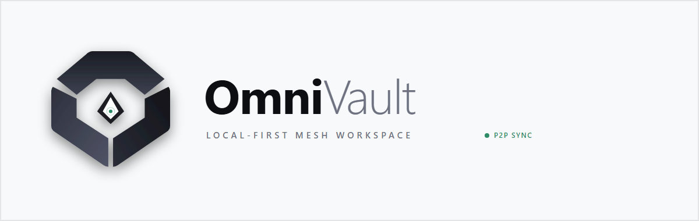

<p align="center">
  <picture>
    <source media="(prefers-color-scheme: dark)" srcset="docs/assets/logo-dark.png">
    
  </picture>
</p>

<p align="center">
  <b>Your own "message yourself" chat, minus the cloud.</b><br>
  Capture on your phone. It's on your laptop by the time you're home.<br>
  No server. No account. Nothing leaves your Wi-Fi.
</p>

<p align="center">
  <a href="https://github.com/webtools-dotcom/OmniVault/releases/latest"></a>
  <a href="https://github.com/webtools-dotcom/OmniVault/releases"></a>
  
  <a href="LICENSE"></a>
</p>

<p align="center">
  
</p>

<p align="center">
  <a href="https://github.com/webtools-dotcom/OmniVault/releases/latest"><b>Download for Windows or Android</b></a>
  &nbsp;·&nbsp; No iPhone or Mac app needed: open it in a browser on the same Wi-Fi
</p>

---

OmniVault is a private, local-first vault for the notes, links, screenshots and
files you send between your own devices. Every device keeps a complete copy,
and devices on the same Wi-Fi find each other and sync on their own.

## Why

Capturing something on your phone and getting it onto your laptop usually means
messaging yourself: a browser tab for the web client, a QR scan, and a single
chronological stream where trades, links, receipts and ideas all pile up
together.

OmniVault is that round trip without the detour. Capture on the phone, straight
into the folder it belongs in. When both devices are next on the same network,
it is already on the laptop. Copy it out in one tap.

The trade-off is deliberate: sync happens when your devices share a network,
not over the internet.

### How it compares

|                                              | OmniVault | Message yourself<br>(WhatsApp, Telegram) | LocalSend | Syncthing |
| :------------------------------------------- | :-------: | :--------------------------------------: | :-------: | :-------: |
| No account, no internet needed               |    Yes    |                    No                    |    Yes    |    Yes    |
| Nothing stored on someone else's server      |    Yes    |                    No                    |    Yes    |    Yes    |
| Other device can be off when you capture     |    Yes    |                   Yes                    |    No     |    Yes    |
| Organised into folders                       |    Yes    |                    No                    |    No     |    Yes    |
| Built for quick notes, links and screenshots |    Yes    |                   Yes                    |    No     |    No     |
| Syncs while you're away from home            |    No     |                   Yes                    |    No     |    Yes    |

## Features

- **Nested folders** with drag and drop, plus a Quick Inbox for things you file
  later.
- **Capture anything** — notes, links, stock or crypto tickers, images and
  documents (PDF, spreadsheets, anything up to 25 MB).
- **Markdown editor** with a formatting toolbar, live preview and autosave.
  Tickers and URLs in your text become one-tap links.
- **Images** pasted with `Ctrl+V` or shared into the app on Android, stored as
  WebP and viewable in a zoomable lightbox.
- **Automatic sync** between paired devices on the same network, including
  networks that block device discovery.
- **One-tap pairing** — tap _Connect_ on one device and _Allow_ on the other.
- **Backup and restore** to a single zip of plain Markdown, media and the
  database.
- **One-tap updates** from inside the app: Windows updates and restarts
  itself; Android hands the new version to the system installer.

## Download

Get the latest build from the
[releases page](https://github.com/webtools-dotcom/OmniVault/releases).

- **Windows** — extract the zip and run `omnivault.exe`. There is no installer.
- **Android** — open the APK on the device and allow installs from your browser
  or file manager. One APK covers phones and tablets.
- **iPhone, iPad, Mac or any other device** — no app to install. On your Windows or Android
  device, open _Connect_, turn on _Allow browser access_ and scan the QR code.
  It opens in any browser on the same network. There is no native iOS or macOS
  build.

Neither binary is signed by a commercial certificate authority, so Windows
SmartScreen and Android will both ask for confirmation. The build steps below
produce the same binaries from source.

## Build from source

Requirements: Node.js 18+, Rust 1.80+, and on Windows the WebView2 runtime. For
Android: the Android SDK, NDK 26+ and JDK 17+.

```bash
npm install
npm run tauri dev      # desktop app with hot reload
npm run dev            # frontend only, in a browser
npm test               # full verification suite
```

`npm test` builds the frontend, runs the Rust unit and integration tests
(including headless two-device sync), runs the frontend regression checks, and
packages both platforms with checksum and signing-key verification.

Release builds and publishing are described in
[docs/RELEASING.md](docs/RELEASING.md).

## How it works

A Rust core owns the SQLite database, the media store, an embedded HTTP server
on port `42420`, and the peer-to-peer sync engine. A single React frontend runs
in the desktop and Android WebViews and, over the LAN, in any browser.

See [docs/ARCHITECTURE.md](docs/ARCHITECTURE.md) for the data model, discovery,
pairing and the sync protocol.

### Local HTTP API

Every route under `/api/` requires a pairing token except the ones marked
public.

| Method       | Endpoint                  | Description                                  |
| :----------- | :------------------------ | :------------------------------------------- |
| `GET`        | `/api/health`             | Liveness and version. Public                 |
| `GET`        | `/api/lan-info`           | LAN address and port. Public                 |
| `POST`       | `/api/pair`               | Exchange a PIN for a device token. Public    |
| `POST` `GET` | `/api/pair/request`       | Pair by approval on the other device. Public |
| `GET`        | `/api/folders`            | All folders                                  |
| `GET`        | `/api/items`              | Items, optionally `?folder_id=<uuid>`        |
| `GET`        | `/api/media/<hash>.<ext>` | An image or document                         |

## Keyboard shortcuts

| Shortcut                | Action                                     |
| :---------------------- | :----------------------------------------- |
| `Ctrl + Enter`          | Save the note or capture                   |
| `Ctrl + B` / `Ctrl + I` | Bold / italic in the editor                |
| `Ctrl + K`              | Insert a link in the editor                |
| `Ctrl + V`              | Paste a screenshot outside the editor      |
| `+` `-` `0`             | Zoom in, out and reset in the image viewer |
| `Esc`                   | Close the open dialog                      |

## Security

Nothing leaves your network, but **sync traffic is not encrypted**: it is built
for a home network or your own hotspot, not public Wi-Fi. Read
[docs/SECURITY.md](docs/SECURITY.md) before using it anywhere else.

## Your data

_Back up_ in the sidebar writes the whole vault to one zip in your downloads
folder: every note as plain Markdown in its folder, the media files, and the
SQLite database for an exact restore. The Markdown needs no app to read.

Back up before updating. If an Android build were ever signed with a different
key, it could not be installed over the existing one, and uninstalling deletes
the vault.

## License

[MIT](LICENSE)
